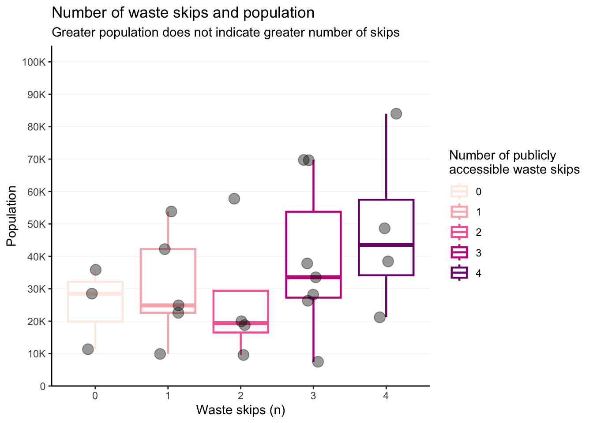
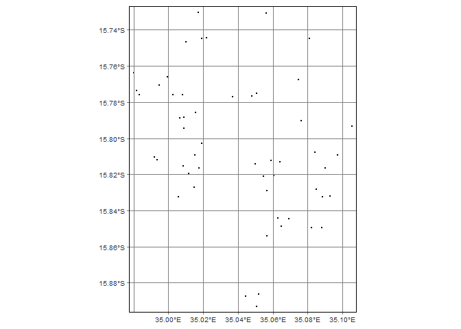
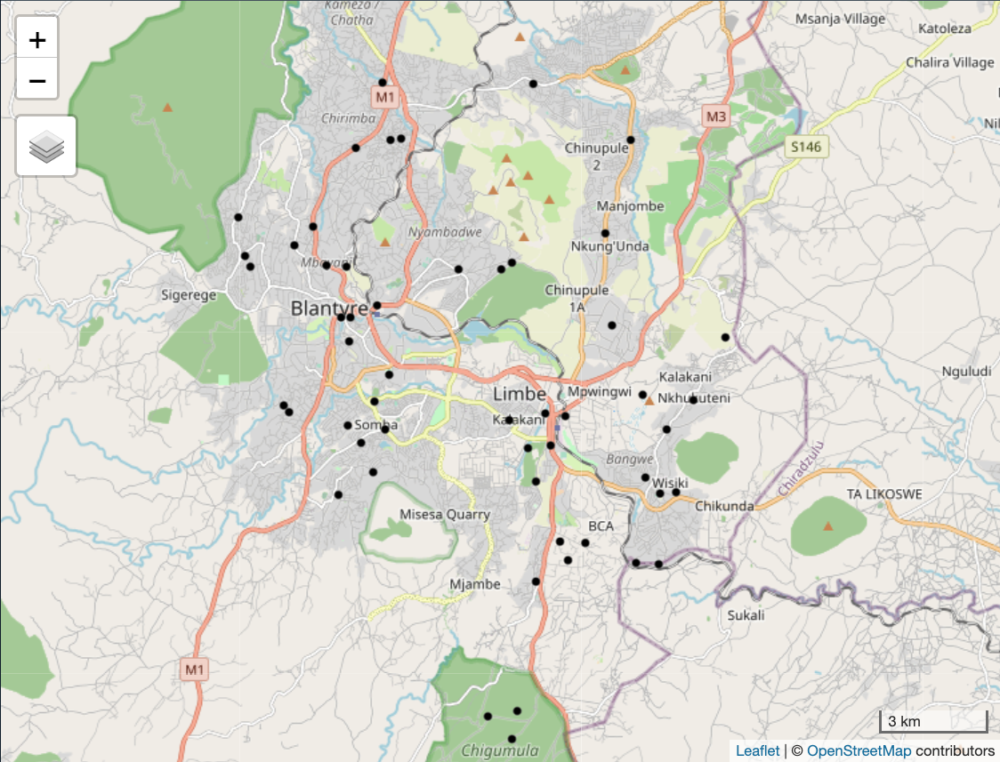

<!-- README.md is generated from README.Rmd. Please edit that file -->

# wasteskipsblantyre

<!-- badges: start -->

[](https://zenodo.org/badge/latestdoi/483225869)
[](https://github.com/openwashdata/wasteskipsblantyre/actions/workflows/R-CMD-check.yaml)

<!-- badges: end -->

The goal of wasteskipsblantyre is to provide a dataset for research and
planning of solid waste management in Blantyre, Malawi. The dataset
includes locations of the publicly accessible waste skips in in the
city. The data was collected in 2021 and has not been updated since.



## Installation

You can install the development version of wasteskipsblantyre from
[GitHub](https://github.com/) with:

``` r
# install.packages("devtools")
devtools::install_github("openwashdata/wasteskipsblantyre")
```

Alternatively, you can download the individual datasets as a CSV or XLSX
file from the table below.

| dataset            | CSV                                                                                                             | XLSX                                                                                                              |
|:-------------------|:----------------------------------------------------------------------------------------------------------------|:------------------------------------------------------------------------------------------------------------------|
| wasteskipsblantyre | [Download CSV](https://github.com/openwashdata/wasteskipsblantyre/raw/main/inst/extdata/wasteskipsblantyre.csv) | [Download XLSX](https://github.com/openwashdata/wasteskipsblantyre/raw/main/inst/extdata/wasteskipsblantyre.xlsx) |

## Project goal

Data on the location of public waste skips in Blanytre was not
available. Without such data, it becomes difficult to develop a solid
waste management plan and logistics. The goal of this project was to
identify the locations of public waste skips in Blantyre, Malawi.

## Data

The data set includes the locations of the publicly accessible waste
skips in Blantyre, Malawi. The data was collected in 2021.

``` r
library(wasteskipsblantyre)
```

The `wasteskipsblantyre` data set has 4 variables and 53 observations.
For an overview of the variable names, see the following table.

``` r
wasteskipsblantyre
```

| variable_name | variable_type | description                                   |
|:--------------|:--------------|:----------------------------------------------|
| name          | character     | Name of the waste skip location.              |
| long          | double        | Longitude of the location as decimal degrees. |
| lat           | double        | Latitude of the location as decimal degrees.  |
| capacity_l    | double        | Capacity of the container in liters.          |

<div class="figure" style="text-align: center">


<p class="caption">
Locations of waste skips in this dataset
</p>

</div>

## Example

The code below is an example which shows how you could use the data to
prepare a map in R. Find this and more examples in the [prepared
examples
article](https://openwashdata.github.io/wasteskipsblantyre/articles/examples.html)
(`vignette("examples")`).

``` r
library(wasteskipsblantyre)
library(sf)
library(tmap)

# read data set into a simple feature (spatial vector data)
sf_wsb <- st_as_sf(wasteskipsblantyre, coords = c('long', 'lat'), crs = 4326)
# set mapping mode to interactive ("view")
tmap_mode("view")
# create an interactive map 
qtm(sf_wsb)
```

<div class="figure" style="text-align: center">


<p class="caption">
Screenshot of the an interactive map with OpenStreetMap layer.
</p>

</div>

## License

Data are available as
[CC-BY](https://github.com/openwashdata/wasteskipsblantyre/blob/main/LICENSE.md).

## Citation

Please cite using:

``` r
citation("wasteskipsblantyre")
#> To cite package 'wasteskipsblantyre' in publications use:
#> 
#>   Yesaya M, Msuku L, Tilley E, Loos S (2023). "wasteskipsblantyre:
#>   Locations of Public Waste Skips in Blantyre, Malawi."
#>   doi:10.5281/zenodo.6470427 <https://doi.org/10.5281/zenodo.6470427>,
#>   <https://openwashdata.github.io/wasteskipsblantyre/>.
#> 
#> A BibTeX entry for LaTeX users is
#> 
#>   @Misc{yesayamsuku:2023,
#>     title = {wasteskipsblantyre: Locations of Public Waste Skips in Blantyre, Malawi},
#>     author = {Mabvuto Yesaya and Limbani Msuku and Elizabeth Tilley and Sebastian Camilo Loos},
#>     year = {2023},
#>     url = {https://openwashdata.github.io/wasteskipsblantyre/},
#>     doi = {10.5281/zenodo.6470427},
#>     abstract = {An R data package containing the locations of public waste skips in Blantyre, Malawi.},
#>     version = {0.0.2},
#>   }
```
