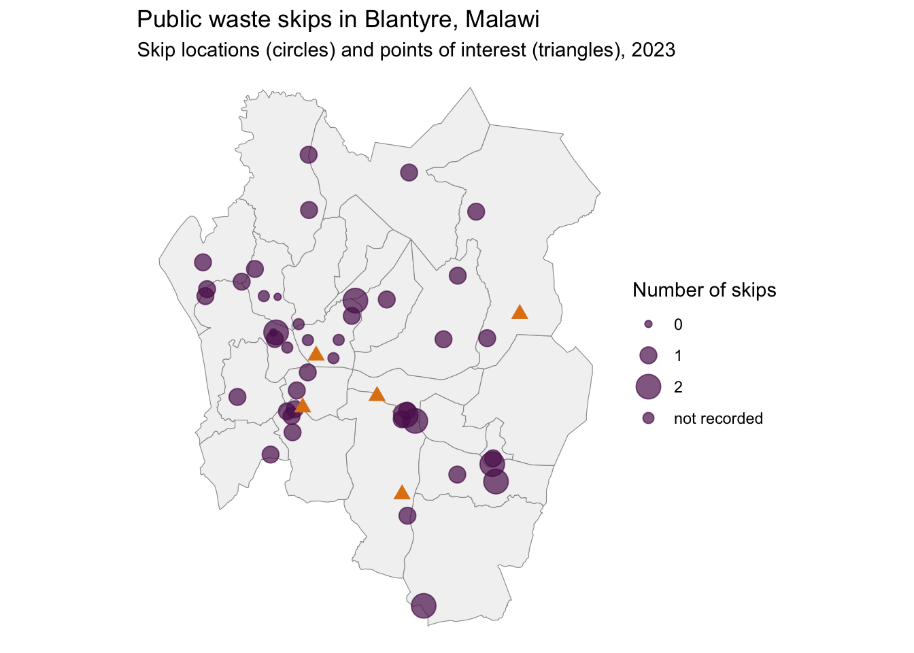

<!-- README.md is generated from README.Rmd. Please edit that file -->

# wasteskipsblantyre

<!-- badges: start -->

[](https://zenodo.org/badge/latestdoi/483225869)
[](https://github.com/openwashdata/wasteskipsblantyre/actions/workflows/R-CMD-check.yaml)
[](https://creativecommons.org/licenses/by/4.0/)

<!-- badges: end -->

The goal of wasteskipsblantyre is to provide data for research and
planning of solid waste management in Blantyre, Malawi. The package
contains two datasets: `skips` holds the locations of the publicly
accessible waste skips in the city, with the number of skips, access and
the fill-up times reported at each location, and `poi` holds the points
of interest for collecting the waste from the skips. The data were
updated in 2023 and replace the 2021 dataset `wasteskipsblantyre` of
earlier versions.



## Installation

You can install the development version of wasteskipsblantyre from
[GitHub](https://github.com/) with:

``` r
# install.packages("devtools")
devtools::install_github("openwashdata/wasteskipsblantyre")
```

Alternatively, you can download the individual datasets as a CSV or XLSX
file from the table below.

| dataset | CSV | XLSX |
|:---|:---|:---|
| skips | [Download CSV](https://github.com/openwashdata/wasteskipsblantyre/raw/main/inst/extdata/skips.csv) | [Download XLSX](https://github.com/openwashdata/wasteskipsblantyre/raw/main/inst/extdata/skips.xlsx) |
| poi | [Download CSV](https://github.com/openwashdata/wasteskipsblantyre/raw/main/inst/extdata/poi.csv) | [Download XLSX](https://github.com/openwashdata/wasteskipsblantyre/raw/main/inst/extdata/poi.xlsx) |

## Project goal

Data on the location of public waste skips in Blantyre was not
available. Without such data, it becomes difficult to develop a solid
waste management plan and logistics. The goal of this project was to
identify the locations of public waste skips in Blantyre, Malawi, and to
record how they are used.

## Data

The package provides access to the locations of the publicly accessible
waste skips in Blantyre, Malawi, and to the points of interest for their
collection.

``` r
library(wasteskipsblantyre)
```

### skips

The `skips` dataset has 13 variables and 67 observations. 47 rows are
named skip locations, 43 of them with coordinates. The last 20 rows have
no name, no location and no other values; they carry only the constant
capacity of 7000 litres per skip (see [issue
\#11](https://github.com/openwashdata/wasteskipsblantyre/issues/11)).
For an overview of the variable names, see the following table.

``` r
skips
```

| variable_name | variable_type | description |
|:---|:---|:---|
| name | character | Main name of skip location. |
| name_other | character | Alternative names of skip location separated by commas. |
| supervision_area | character | Cleansing supervision area. |
| context | character | Type of urban environment surrounding skip location. |
| direct_access | character | Vehicle access path type. |
| fillup | double | Number of days to fill up according to person surveyed. |
| fillup_dry | double | Number of days to fill up in dry season according to person surveyed. |
| fillup_rainy | double | Number of days to fill up in rainy season according to person surveyed. |
| number_skips | double | Number of skips at skip location. |
| capacity | double | Capacity of one skip in litres. |
| y | double | Y (latitude) coordinate in WGS 84. |
| x | double | X (longitude) coordinate in WGS 84. |
| notes | character | Notes relating to skip location. |

### poi

The `poi` dataset has 3 variables and 5 observations: the depot, the
Mzedi dump site, the compost site and two gas stations. For an overview
of the variable names, see the following table.

``` r
poi
```

| variable_name | variable_type | description                         |
|:--------------|:--------------|:------------------------------------|
| poi           | character     | Point of interest.                  |
| lat           | double        | Y (latitude) coordinate in WGS 84.  |
| long          | double        | X (longitude) coordinate in WGS 84. |

## Example

The code below is an example which shows how you could use the data to
prepare an interactive map in R. Find more examples in the [prepared
examples
article](https://openwashdata.github.io/wasteskipsblantyre/articles/examples.html).

``` r
library(wasteskipsblantyre)
library(dplyr)
library(sf)
library(tmap)

# read the skip locations with coordinates into a simple feature
sf_skips <- skips |>
  filter(!is.na(x), !is.na(y)) |>
  st_as_sf(coords = c("x", "y"), crs = 4326)
# set mapping mode to interactive ("view")
tmap_mode("view")
# create an interactive map
qtm(sf_skips)
```

## License

Data are available as
[CC-BY](https://github.com/openwashdata/wasteskipsblantyre/blob/main/LICENSE.md).

## Citation

Please cite using:

``` r
citation("wasteskipsblantyre")
#> To cite package 'wasteskipsblantyre' in publications use:
#> 
#>   Yesaya M, Msuku L, Tilley E, Loos S (2023). "wasteskipsblantyre:
#>   Locations of Public Waste Skips in Blantyre, Malawi."
#>   doi:10.5281/zenodo.6470427 <https://doi.org/10.5281/zenodo.6470427>.
#>   <https://openwashdata.github.io/wasteskipsblantyre/>.
#> 
#> A BibTeX entry for LaTeX users is
#> 
#>   @Misc{yesayamsuku:2023,
#>     title = {wasteskipsblantyre: Locations of Public Waste Skips in Blantyre, Malawi},
#>     author = {Mabvuto Yesaya and Limbani Msuku and Elizabeth Tilley and Sebastian Camilo Loos},
#>     year = {2023},
#>     url = {https://openwashdata.github.io/wasteskipsblantyre/},
#>     doi = {10.5281/zenodo.6470427},
#>     abstract = {An R data package containing the locations of public waste skips in Blantyre, Malawi.},
#>     version = {0.0.2},
#>   }
```
