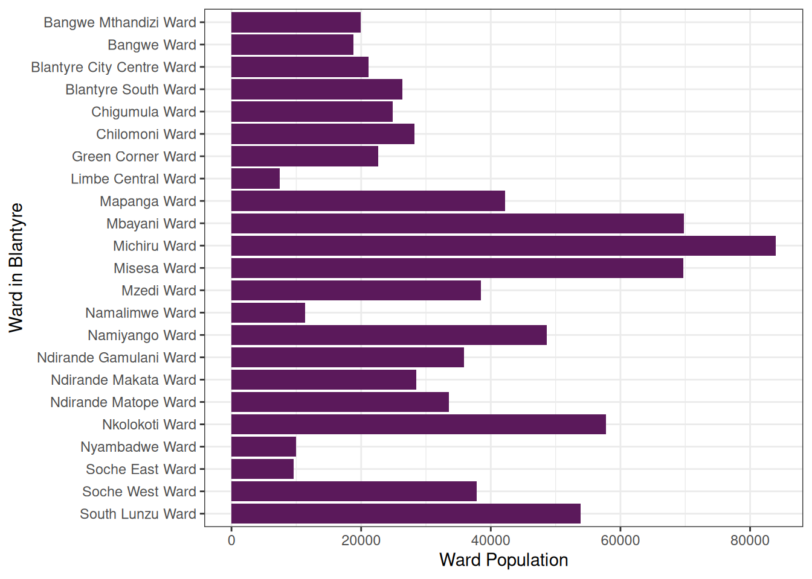

# Examples

**The following article is an example that shows how to work with the
data package and produce insights using R.**

## Setting things up

### Load Packages

``` r

# install.packages("devtools")
# devtools::install_github("openwashdata/wasteskipsblantyre")
library(wasteskipsblantyre)
library(tidyverse)
library(sf)
library(here)
```

### Read in Data Sets

First, additional files including data sets with specific census data
about Blantyre has been added to the package from
<https://data.humdata.org>. For this fictional article we will use
spatial data and therefore, the data has to be read in as [simple
features](https://en.wikipedia.org/wiki/Simple_Features) using the
[`sf-package`](https://r-spatial.github.io/sf/) as you can see in the
following code chunk.

``` r

# read in ward boundaries data
census_boundaries <- 
  st_read(here::here("vignettes", "articles",
                     "traditional-authorities", "Malawi_TA_2018.shp")) |> 
  st_as_sf()

# read in traditional authority population data
census_data <- read_csv(here::here("vignettes", "articles", 
                                   "traditional-authorities", 
                                   "census_data.csv"))

# read the skip locations with coordinates into a simple feature
# (spatial vector data) and set the coordinate reference system equal to
# the one from census_boundaries
sf_skips <- skips |> 
  filter(!is.na(x), !is.na(y)) |> 
  st_as_sf(coords = c("x", "y"), crs = 4326) |> 
  st_transform(st_crs(census_boundaries))

# wards of Blantyre City
wards <- census_boundaries |> 
  filter(DIST_NAME == "Blantyre City")
```

## Background

Malawi is an eastern sub-Saharan state. For this article the area of the
city of Blantyre has been explored as depicted in the following map.

``` r

ggplot(wards) +
  geom_sf(fill = "grey95", colour = "grey40") +
  theme_void()
```


Figure 1: Boundaries of the wards in Blantyre.

The city is divided in 23 wards. This article will use these areas to
explore the data contained in the `wasteskipsblantyre` package. The
`skips` dataset stores the locations of publicly accessible waste skips
in Blantyre (map below), updated in 2023. 43 of its 67 rows have
coordinates; the rows without coordinates are left out of this article.

``` r

ggplot() +
  geom_sf(data = wards, fill = "grey95", colour = "grey40") +
  geom_sf(data = sf_skips, colour = "#5b195b", size = 2) +
  theme_void()
```


Figure 2: Locations of the publicly accessible waste skips in Blantyre,
Malawi.

In addition, data from the 2018 Malawi Census population data set shared
by National Statistical Office is used for some demographic analysis.

## Hypothesis

In the context of this fictional article we define a hypothesis:

*The number of waste skips within traditional authorities (wards)
correlates with the population of each authority.*

## Analysis

First, we have a separate look into the waste skips data and the data
from the 2018 census for each ward within Blantyre. After that we
compare the two data sets and look for possible correlations.

### Waste Skips Data

The `skips` dataset records 42 public waste skips at 47 named locations;
some locations have no skip anymore or no count of skips. In Figure
[3](#fig:count-ta) it is visible that the number of waste skips in a
ward varies between 0 and 4. On average, there are 1.8 waste skips in a
ward.

``` r

count_ta |> 
  ggplot(aes(y = forcats::fct_rev(TA_NAME), x = n)) +
  geom_col(fill = "#5b195b") +
  geom_vline(xintercept = mean(count_ta$n)) +
  labs(x = "Number of publicly accessible waste skips",
       y = "Ward in Blantyre") +
  theme_bw()
```


Figure 3: Number of waste skips in each ward.

The city center is located to the west of the city. The map below
colours each ward by the number of waste skips within its boundaries.

``` r

count_ta |> 
  mutate(n = factor(n)) |> 
  ggplot() +
  geom_sf(aes(fill = n), colour = "grey40", alpha = 0.8) +
  geom_sf(data = sf_skips, size = 1) +
  scale_fill_brewer(palette = "RdPu") +
  labs(fill = "Number of publicly\naccessible waste skips") +
  theme_void()
```


Figure 4: Wards coloured according to the number of waste skips that
they have within their boundaries.

### Population Data

``` r

pop_blantyre <- sum(pop_ta$ta_pop)
```

In 2018, Blantyre City’s population was 800,264. The population for each
ward can be seen in Figure [5](#fig:barplot-pop).

``` r

pop_ta |> 
  ggplot(aes(x = ta_pop, y = forcats::fct_rev(TA_NAME))) +
  geom_col(fill = "#5b195b") +
  labs(x = "Ward Population",
       y = "Ward in Blantyre") +
  theme_bw()
```



Figure 5: Population per ward.

Since the areas of the wards differ, we will have a look into the
population density of the wards in Figure [6](#fig:barplot-density).

``` r

density_data |> 
  ggplot(aes(x = density_popkm2, y = forcats::fct_rev(TA_NAME))) +
  geom_col(fill = "#5b195b") +
  labs(x = "Population Density (per km^2)",
       y = "Ward in Blantyre") +
  theme_bw()
```


Figure 6: Population density per ward.

### Comparison

In order to cross check the data and validate the hypothesis the data
sets are linked together and visualized in the following figures.

Figure [7](#fig:count-pop) shows the population of each ward, coloured
by the number of waste skips within the ward. The correlation between
the number of waste skips and the ward population is 0.13.

``` r

density_data |> 
  ggplot(aes(x = ta_pop, y = forcats::fct_rev(TA_NAME))) +
  geom_col(aes(fill = factor(n))) +
  scale_fill_brewer(palette = "RdPu") +
  labs(x = "Ward Population",
       y = "Ward in Blantyre",
       fill = "Number of publicly\naccessible waste skips") +
  theme_bw()
```


Figure 7: Ward population, coloured by the number of waste skips within
the ward.

Figure [8](#fig:count-density) does the same for the population density.
The correlation between the number of waste skips and the population
density is -0.11. The wards without a waste skip are, from the most to
the least densely populated: Ndirande Makata Ward, Ndirande Gamulani
Ward, Bangwe Mthandizi Ward, Mzedi Ward, and Nyambadwe Ward.

``` r

density_data |> 
  ggplot() +
  geom_col(aes(x = density_popkm2, y = forcats::fct_rev(TA_NAME), fill = factor(n))) +
  scale_fill_brewer(palette = "RdPu") +
  labs(x = "Population Density (per km^2)",
       y = "Ward in Blantyre",
       fill = "Number of publicly\naccessible waste skips") +
  theme_bw()
```


Figure 8: Ward population density, coloured by the number of waste skips
within the ward.

## Conclusion

The correlation coefficients above show how closely the number of waste
skips in a ward follows its population and population density. Check the
[source
code](https://github.com/openwashdata/wasteskipsblantyre/blob/main/vignettes/articles/examples.Rmd)
to reproduce the analysis with the `skips` data.

**We hope you enjoyed this fictional article!**
